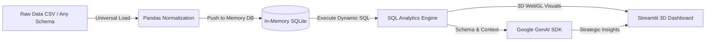

# 🌌 Universal 3D AI Data Analytics & SQL Intelligence

[](https://ai-powered-retail-analytics-dashboard-h9ptq4akd939gj4zqkqj5g.streamlit.app/)
[](https://www.python.org/)
[](https://opensource.org/licenses/MIT)
[](https://ai.google.dev/)
[](https://plotly.com/)

An interactive, high-performance data intelligence web application combining **Python**, **Pandas**, an in-memory **SQLite** querying engine, **Interactive 3D WebGL / Three.js Visualizations**, and the **Google GenAI SDK (Gemini)** with a responsive **Streamlit** dashboard.

---

## 🌐 Live Web Application

Experience the live interactive application hosted on Streamlit Community Cloud:

👉 **[https://ai-powered-retail-analytics-dashboard-h9ptq4akd939gj4zqkqj5g.streamlit.app/](https://ai-powered-retail-analytics-dashboard-h9ptq4akd939gj4zqkqj5g.streamlit.app/)**

---

## 🏗️ Architecture & Data Pipeline Flow



### Key Highlights & Features:
1. **Universal & Schema-Agnostic**: Works with **any CSV dataset**, any number of rows (from 10 to 500,000+), any column count, and any data domain (Retail, Sales, Finance, HR, Healthcare, Operations, or Text Surveys).
2. **Interactive 3D Movable Studio**:
   - **Three.js Cybernetic Architecture**: Interactive 3D pipeline hero at the top—click and drag to orbit 360°, scroll to zoom, and watch live data particle flows.
   - **Movable 3D Plotly Space**: Full 3D scatter and surface plotting with user-selectable X, Y, and Z (Depth) axes, 360° mouse rotation, and 3D hover spike projections.
   - **Drill-Down Sunburst & Donut Charts**: Interactive multi-level categorical exploration.
3. **In-Memory SQL Performance**: Sub-millisecond SQL querying using in-memory SQLite (`:memory:`) without persistent disk overhead or locks.
4. **Natural Language Text-to-SQL**: Ask any question in plain English (e.g., *"Which category generated the highest volume?"*). Gemini translates your prompt into SQLite syntax, executes it against your data, and explains the findings.
5. **3D Glassmorphic UI**: Ambient lighting, layered 3D shadows, frosted backdrop blurs, and hover lift effects.
6. **Gemini AI Strategic Consultant**: Generates executive summaries, risk factors, and 3 prioritized actionable business recommendations using an intelligent multi-model cascade (`gemini-3-flash-preview` / `gemini-2.5-flash` / `gemini-flash-latest`).

---

## 🚀 Quickstart Guide

### 1. Prerequisites
- **Python 3.9+** installed locally
- A **Gemini API Key** from [Google AI Studio](https://aistudio.google.com/)

### 2. Local Setup

```bash
# 1. Clone the repository
git clone https://github.com/Lasya-Kolluru/AI-Powered-Retail-Analytics-Dashboard.git
cd AI-Powered-Retail-Analytics-Dashboard

# 2. Install dependencies
pip install -r requirements.txt

# 3. Configure your Gemini API Key
# Copy the template to .streamlit/secrets.toml
cp .streamlit/secrets.toml.template .streamlit/secrets.toml
```

Add your Gemini API key in `.streamlit/secrets.toml`:
```toml
GEMINI_API_KEY = "your-actual-api-key-here"
```

*(Note: You can also enter the API key directly in the dashboard sidebar at runtime if preferred).*

### 3. Launch Dashboard

```bash
streamlit run app.py
```

The application will launch automatically at `http://localhost:8501`.

---

## ☁️ Deployment on Streamlit Community Cloud

1. Fork or clone this repository: `Lasya-Kolluru/AI-Powered-Retail-Analytics-Dashboard`
2. Log into [Streamlit Community Cloud](https://share.streamlit.io/) with GitHub.
3. Select the repository, branch (`main`), and main file (`app.py`).
4. Under **Advanced settings...** ➔ **Secrets**, paste:
   ```toml
   GEMINI_API_KEY = "your-gemini-api-key"
   ```
5. Click **Deploy!**

---

## 📁 Repository Structure

```text
├── app.py                            # Universal Streamlit application, 3D visual studio, & GenAI engine
├── requirements.txt                  # Python dependencies (Streamlit, Pandas, Google-GenAI, Plotly)
├── LICENSE                           # MIT License (Lasya Kolluru)
├── README.md                         # Project documentation and architectural overview
├── .gitignore                        # Secret isolation & cache exclusions
├── .streamlit/
│   ├── config.toml                   # Executive dark UI styling and client options
│   └── secrets.toml.template         # Sanitized secrets configuration template
├── data/
│   └── sample_retail_data.csv        # Comprehensive sample dataset
└── tests/
    ├── test_pipeline.py              # Automated unit tests for SQL pipeline
    ├── test_generalized.py           # Adaptive schema tests
    └── test_universal.py             # Multi-domain compatibility tests (Retail, HR, Text)
```

---

## 📜 License
This project is licensed under the MIT License - see the [LICENSE](LICENSE) file for details.

Developed by **Lasya Kolluru** (2026).
