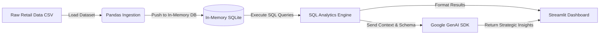

# 🛍️ AI-Powered Retail Analytics Dashboard

[](https://share.streamlit.io/)
[](https://www.python.org/)
[](https://opensource.org/licenses/MIT)
[](https://ai.google.dev/)

A high-performance retail analytics web application built with **Python**, **Pandas**, an in-memory **SQLite** querying engine, and the **Google GenAI SDK (Gemini)** with an interactive **Streamlit** dashboard.

---

## 🏗️ Architecture & Data Pipeline Flow



### Key Technical Pillars:
1. **Data Ingestion**: Upload custom CSV transactions or load the pre-bundled retail sales dataset.
2. **In-Memory SQL Engine**: Converts sanitized data directly into an in-memory SQLite database (`:memory:`) as the `retail_sales` table for sub-millisecond query performance without disk I/O locks.
3. **Automated Metrics Extraction**: Pre-configured SQL queries analyze:
   - 🏆 Top 5 Products by Gross Revenue
   - 🌍 Regional Sales and Transaction Breakdown
   - 👥 Customer Segment & Payment Distribution
   - 📦 Category-level Volume & Yield
4. **Interactive SQL Playground**: Run ad-hoc SQL queries with instant schema inspection.
5. **AI Business Consultant**: Uses the modern `google-genai` SDK with an intelligent multi-model cascade (`gemini-3-flash-preview` / `gemini-2.5-flash` / `gemini-flash-latest`) to generate executive summaries, risk factors, and 3 actionable business recommendations.

---

## 🚀 Quickstart Guide

### 1. Prerequisites
- **Python 3.9+** installed locally
- A **Gemini API Key** from [Google AI Studio](https://aistudio.google.com/)

### 2. Local Setup

```bash
# 1. Clone the repository
git clone https://github.com/Lasya-Kolluru/AI-Powered-Retail-Analytics-Dashboard.git
cd AI-Powered-Retail-Analytics-Dashboard

# 2. Install dependencies
pip install -r requirements.txt

# 3. Configure your Gemini API Key
# Copy the template to .streamlit/secrets.toml
cp .streamlit/secrets.toml.template .streamlit/secrets.toml
```

Add your Gemini API key in `.streamlit/secrets.toml`:
```toml
GEMINI_API_KEY = "your-actual-api-key-here"
```

*(Note: You can also enter the API key directly in the dashboard sidebar at runtime if preferred).*

### 3. Launch Dashboard

```bash
streamlit run app.py
```

The application will launch automatically in your browser at `http://localhost:8501`.

---

## ☁️ Deployment to Streamlit Community Cloud

1. Fork or clone this repository to your GitHub account: `Lasya-Kolluru/AI-Powered-Retail-Analytics-Dashboard`
2. Log into [Streamlit Community Cloud](https://share.streamlit.io/) with GitHub.
3. Click **"New app"** and configure:
   - **Repository:** `Lasya-Kolluru/AI-Powered-Retail-Analytics-Dashboard`
   - **Branch:** `main`
   - **Main file path:** `app.py`
4. Click **"Advanced settings..."** ➔ **Secrets** and paste:
   ```toml
   GEMINI_API_KEY = "your-gemini-api-key"
   ```
5. Click **"Deploy!"** — Your app is live with a public URL!

---

## 📁 Repository Structure

```text
├── app.py                            # Core Streamlit app & Google GenAI integration
├── requirements.txt                  # Python dependencies
├── LICENSE                           # MIT License (Lasya Kolluru)
├── README.md                         # Project documentation and architectural overview
├── .gitignore                        # Secret isolation & build artifact exclusions
├── .streamlit/
│   ├── config.toml                   # Executive dark UI styling and client options
│   └── secrets.toml.template         # Sanitized secrets configuration template
├── data/
│   └── sample_retail_data.csv        # Realistic 30-record sample dataset
└── tests/
    └── test_pipeline.py              # Automated unit tests for SQL logic & schema
```

---

## 📜 License
This project is licensed under the MIT License - see the [LICENSE](LICENSE) file for details.

Developed by **Lasya Kolluru** (2026).
